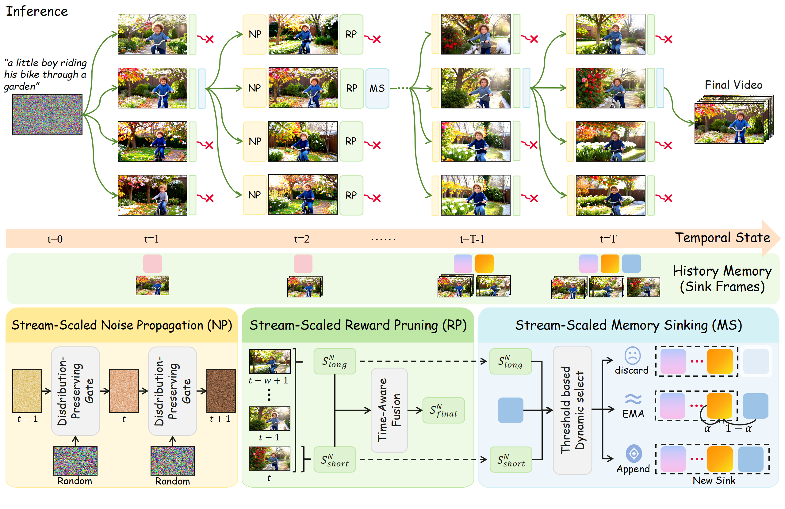

<div align="center">

<h1>Stream-T1: <br> Test-Time Scaling for Streaming Video Generation</h1>

<div>
  <a href="#" target="_blank"><strong>Yijing Tu</strong></a><sup>1</sup>,
  <a href="#" target="_blank"><strong>Shaojin Wu</strong></a><sup>3,&dagger;</sup>,
  <a href="https://corleone-huang.github.io/" target="_blank"><strong>Mengqi Huang</strong></a><sup>1,&dagger;</sup>,
  <a href="#" target="_blank">Wenchuan Wang</a><sup>1</sup>,
  <a href="#" target="_blank">Yuxin Wang</a><sup>2</sup>,
  <a href="#" target="_blank"> Chunxiao Liu</a><sup>3</sup>,
  <a href="#" target="_blank">Zhendong Mao</a><sup>1,*</sup>
</div>

<br>

<div>
  <sup>1</sup> University of Science and Technology of China,
  <sup>2</sup> FrameX.AI,
  <sup>3</sup> Independent Researcher
</div>

<br>

<sub><sup>*</sup> Corresponding author &nbsp;&middot;&nbsp; <sup>&dagger;</sup> Project lead</sub>

[](https://stream-t1.github.io/)
[](#) <!-- arXiv link to be added -->

</div>

## Overview
While Test-Time Scaling (TTS) offers a promising direction to enhance video generation without the surging costs of training, current test-time video generation methods based on diffusion models suffer from exorbitant candidate exploration costs and lack temporal guidance. To address these structural bottlenecks, we propose shifting the focus to streaming video generation. We identify that its chunk-level synthesis and few denoising steps are intrinsically suited for TTS, significantly lowering computational overhead while enabling fine-grained temporal control. Driven by this insight, we introduced Stream-T1, a pioneering comprehensive TTS framework exclusively tailored for streaming video generation. Evaluated on both 5s and 30s comprehensive video benchmarks, Stream-T1 demonstrates profound superiority, significantly improving temporal consistency, motion smoothness, and frame-level visual quality.

### Method
1. **Stream‑Scaled Noise Propagation**: actively refines the initial latent noise of the generating chunk using historically proven, high-quality previous chunk noise, effectively establishes temporal dependency and utilizing the historical Gaussian prior to guide the current generation;
2. **Stream‑Scaled Reward Pruning**: comprehensively evaluates generated candidates to strike an optimal balance between local spatial aesthetics and global temporal coherence by integrating immediate short-term assessments with sliding-window-based long-term evaluations; 
3. **Stream‑Scaled Memory Sinking**: dynamically routes the context evicted from KV-cache into distinct updating pathways guided by the reward feedback, ensuring that previously generated visual information effectively anchors and guides the subsequent video stream.

<p align="center">
    
</p>

## TODO List

- [x] Release the paper and project page.
- [x] Release the inference code.
- [x] Release test cases with our pretrained model, prompts, and reference image.

## Requirements
The inference are conducted on 1 A800 GPU (80GB VRAM)
## Setup
```
git clone https://github.com/Ttttttttyj/Stream-T1.git
cd Stream-T1

cd metrics
https://github.com/KlingAIResearch/VideoAlign.git
```

## Environment
All the tests are conducted in Linux. To set up our environment in Linux, please run:
```
conda create -n StreamT1 python=3.10 -y
conda activate StreamT1

pip install -r requirements.txt
```

## Checkpoints
1.base model checkpoints
```
huggingface-cli download Efficient-Large-Model/LongLive --local-dir longlive_models
huggingface-cli download Wan-AI/Wan2.1-T2V-1.3B --local-dir wan_models/Wan2.1-T2V-1.3B
```
2.reward model checkpoints
```
huggingface-cli download MizzenAI/HPSv3 --local-dir metrics/models/hpsv3_model
huggingface-cli download KlingTeam/VideoReward --local-dir metrics/models/videoalign
```
## Inference
```
bash stream_scaling.sh
```
## Citation:
Don't forget to cite this source if it proves useful in your research!
```
```
## Acknowledgement:
- LongLive: the codebase and algorithm we built upon. Thanks for their wonderful work.
- HPSv3 and videoalign: the reward model we use. Thanks for their wonderful work.
## License
See [LICENSE](LICENSE).